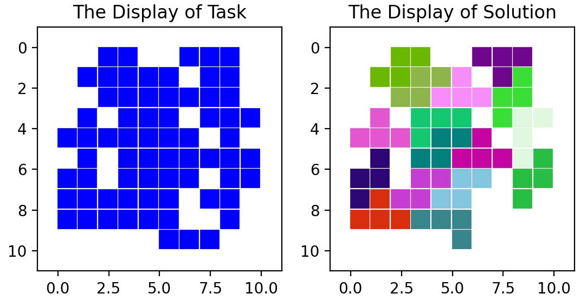
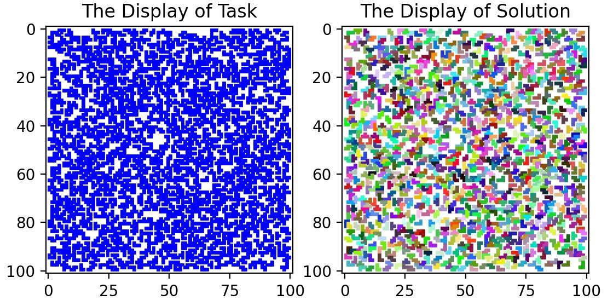

# Tetromino 

Algorithm to solve the tetriling with missing pieces problem from randomly generated grids using Tetris pieces. Greedy algorithm using a binary search tree and a depth first search approach. 

- main.py: tetriling solver algorithm.
- utils.py: visualisation and generation of grid.
- performance_std.py: performance test of the solver to evaluate it. 

  

Fastest solver of the year, average of 0.004s for 1000x1000 matrix with 0.7 density, and ranked among the top 20 in accuracy, average of 95% accuracy for the same matrix.

  

